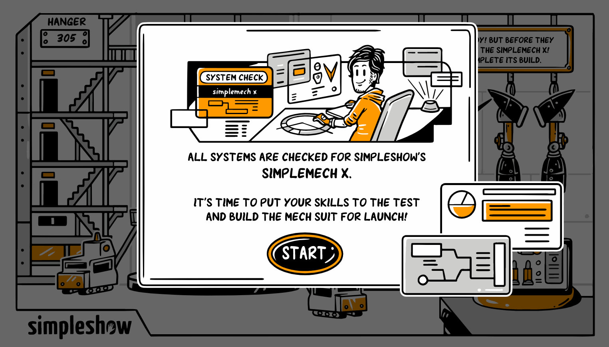

## Developer Assessment Test for SimpleShow
This project is a developer test for a job position in [SimpleShow](https://simpleshow.com/us-en/). 👏🏻

### Run this project

- Fork this repo.
- Clone this repo.
- Open the `index.html` document.

### Purpose

The candidate will build a _Drag & Drop_ feature using SimpleShow assets as SVGs. The theme is playful: a mech suit build in the vein of Japanese mecha comics/cartoons, “Pacific Rim,” and “Iron Man”. 

The project was developed with __jQuery__, __HTML__, __CSS__ and __JS__.

### Result

  

### Author

I'm a web developer and UX/UI designer. 👩🏻‍💻 Let's keep in touch:

- Email: [renatah2198@gmail.com](mailto:renatah2198@gmail.com)
- LinkedIn: [Renata Hurtado Moreno](https://www.linkedin.com/in/renatahdo/)

